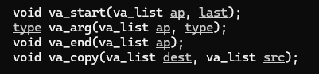

- [[ft_printf project]] : concepts to master ->
	- [[static variables]]
	- [[variadic functions]]
		- **man va_arg** -> [[manual page]] for variadic functions *STDARG(3)*
		- NAME
		         stdarg, va_start, va_arg, va_end, va_copy - <ins>variable argument lists</ins>
		- **#include <stdarg.h>** -> [[headers]] for it.
		- 
		- *Description*
		- A function may be called with a varying number of arguments of varying types.  The include file <stdarg.h> declares a type va_list:
		- [[type]]
			- [[va_list]] and defines three [[macros]] for stepping through a list of arguments whose number and types are not known to the called function.
			- The  called  function must declare an [[object]] of type va_list which is used by the
			- [[macros]]
				- [[va_start()]], [[va_arg()]], and [[va_end()]].
				- **va_start()**
					- The va_start() macro initializes <ins>ap</ins> for subsequent use by va_arg() and va_end(), and must be called first.
					- The argument last is the name of the last argument before the variable argument list, that is,
					  the last  argument of which the calling function knows the type.
					- Because  the address of this argument may be used in the va_start() macro, it should not be declared as a register variable, or as a function or an array type.
				-
-