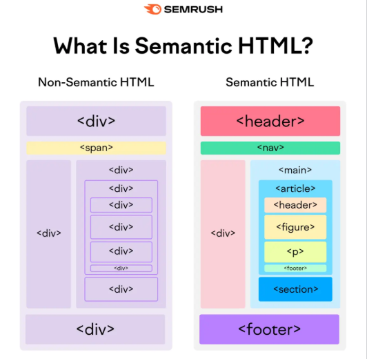
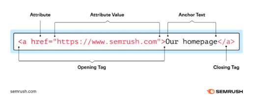
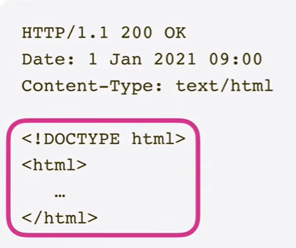

- [[Markup]]
	- [Types of Markup languages]
	  collapsed:: true
		- **Semantic markup** (descriptive which can help browsers, engines interpret  the content) - XML
			- 
		- **Presentational markup** - HTML
		- **Procedural markup** (provides step-by-step commands for how content should be processed) - LaTex
	- [7 Markup language examples ]
		- 1. **[[HTML]]** - hyper text markup language
			- Many kinds of HTML tags include [[attributes]] [[url]], which provide additional information about the element.
			- [[Attributes]] have a name and a value. For example, the [[href ]] [[attribute ]] is used to define a [[hyperlink]]’s destination:
			- 
			- HTML is commonly used with [[JavaScript]](a programming language that adds interactivity) and [[css]] (a style sheet language that defines the styling of HTML content).
		- 2. **XML** - extensible markup language: used for storing and transporting data.
		- 3. **Markdown** - lightweight markup language that uses symbols to format text in a plain text-editor.
		- collapsed:: true
		  4. **SVG** - Scalable Vector Graphics used to describe vector graphics.
			- Vector graphics are images created from mathematical equations. This means they can only be used for relatively simple graphics, but these graphics can be resized without losing quality.
			- For example, the SVG code below creates a blue circle that takes up 80% of the smallest side of its container and is centered in the container.
			- *`<svg viewBox="0 0 100 100" width="100%" height="100%" xmlns="http://www.w3.org/2000/svg">
			    <circle cx="50" cy="50" r="40" fill="blue" />
			  </svg>` *
			- SVG images remain sharp at any size and typically load faster than raster graphics (such as JPEGs and PNGs). This makes SVG a good choice for logos, icons, charts, and other simple graphics.
		- collapsed:: true
		  5. **LaTex**
			- is a procedural markup language generally used to prepare scientific papers, research articles, and mathematical content—usually in a PDF format.
			- The language allows users to display complex equations with proper notation, like this:
			- 
			- LaTeX also makes handling citations, bibliographies, footnotes, and other elements that can be challenging to manage in other markup languages easier.
		- 6. **SGML** - standard generalized markup language: is a framework for creating markup languages - it was a foundation for HTML and XML.
			- SGML (standard generalized markup language) is a framework for creating markup languages—it was the foundation for HTML and XML.
			- To start with SGML, craft a Document Type Definition (DTD). The DTD outlines the document structure and lists the elements, attributes, and entities you will use.
			- You can then write your document according to these established guidelines.
			- Here’s a brief example:
			- ```
			- <!DOCTYPE book [
			    <!ELEMENT book (title, chapter+)>
			    <!ELEMENT title (PCDATA)>
			    <!ELEMENT chapter (PCDATA)> ]>
			  <book>
			    <title>Sample SGML Document</title>
			    <chapter>Introduction to SGML</chapter>
			  </book>
			- ```
			- Today, most developers prefer to use HTML or XML instead of SGML. Because HTML and XML are more user-friendly and widely supported.
		- 7. **XHTML** - is a blend of HTML and XML that merges HTML’s presentation features with XML’s strict syntax rules.
			-
			- XHTML was developed to improve code and browser compatibility. But many of these improvements became redundant with the introduction of HTML5.
			- Most developers now use HTML5 over XHTML due to HTML5’s adaptability and ability to keep up with the evolving digital landscape.
		-
	- p.s. resources from =>  https://www.semrush.com/blog/markup-language/
- [[Frameworks]]
	- * React [[JavaScript]]
	- * Vue [[JavaScript]]
	- * Angular [[JavaScript]]
- [[URL]]
	- URL - Uniform Resource Locator
	- [[HTTP]] [[http_request]]
		- HTTP - Hypertext Transfer Protocol
		- [[HTTPS]]- HTTP  + Encryption ->  f.e.
		- 
		  id:: 69be93b7-d29b-40d6-961b-5a3aa491dfcc
		- As the browser reads this document (200 means ok connection succeeded), it constructs what we call a [[DOM]]. As the browser is reading this [[html]] document that is returned from the server it discovers [[references]] to other resources in this document(like images, fonts and other stuff). Each of these resources has an [[address]] or [[URL]], so for each resource the [[browser]] sends separate [[http_request]] to the [[server]] to [[fetch]] that resource.
		- Many of these [[http_request]]s are set in parallel so we can see the page as quickly as possible. Once the browser has all the necessary resources it will [[render]] the html document.
-