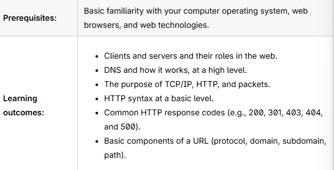
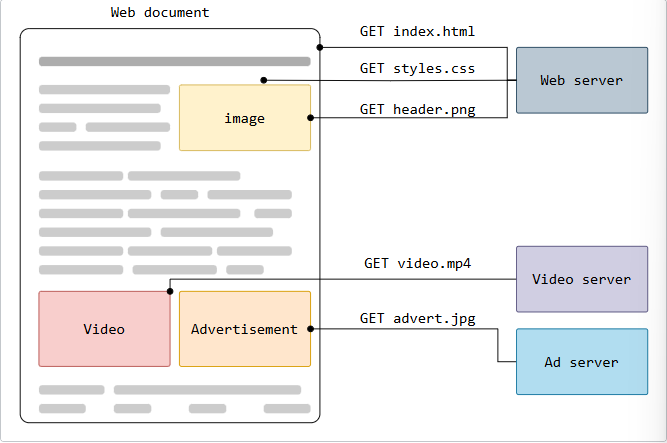
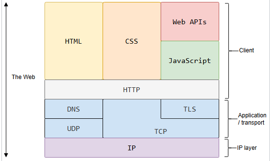
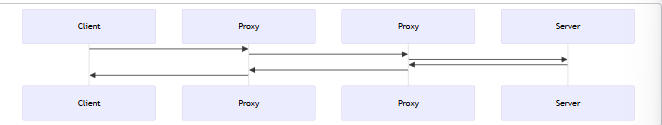

- How the [[web]] works?
	- 
	- **Clients and servers**
	  collapsed:: true
		- Computers connected to the internet are called **clients** and **servers**. A simplified diagram of how they interact might look like this:
		- {:height 162, :width 491}
		- Clients are the typical web user's internet-connected devices (for example, your computer connected to your Wi-Fi, or your phone connected to your mobile network) and web-accessing software available on those devices (usually a web browser like Firefox or Chrome).
		- Servers are computers that store webpages, sites, or apps. When a client wants to access a webpage, a copy of the webpage code is downloaded from the server to the client machine, where it is rendered by the browser and displayed to the user.
	- [[TCP]]/[[IP]]: **Transmission Control Protocol** and **Internet Protocol** are communication protocols that define how data should travel across the internet. This is like the transport mechanisms that let you place an order, go to the shop, and buy your goods. In our example, this is like a car or a bike (or however else you might travel along the road).
	- [[DNS]]: The Domain Name System is like an address book for websites. When you type a web address, the browser looks at the DNS to find the website's IP address - the actual address the server is located at - before it can retrieve the website. The browser needs to find out which server the website lives on, so it can send [[HTTP]] messages to the right place. This is like looking up the address of the shop before you visit it.
	- [[HTTP]]: **Hypertext Transfer Protocol** is an application **[[protocol]]** that defines a language for clients and servers to speak to each other. It is a protocol for fetching resources such as HTML documents. It is foundation of any data exchange on the web and it is a client-server protocol, which means requests are initiated by the recipient, usually the web browser.
	  collapsed:: true
		- 
		- Clients and servers communicate by exchanging individual messages (as opposed to a stream of data). The messages sent by the client are called *requests* and the messages sent by the server as an answer are called *responses*.
		- 
		- Designed in the early 1990s, HTTP is an extensible protocol which has evolved over time. It is an application layer protocol that is sent over [TCP](https://developer.mozilla.org/en-US/docs/Glossary/TCP), or over a [TLS](https://developer.mozilla.org/en-US/docs/Glossary/TLS)-encrypted TCP connection, though any reliable transport protocol could theoretically be used. Due to its extensibility, it is used to not only fetch hypertext documents, but also images and videos or to post content to servers, like with HTML form results. HTTP can also be used to fetch parts of documents to update Web pages on demand.
		- **Components of HTTP-based systems**
		  collapsed:: true
			- HTTP is a client-server protocol: requests are sent by one entity, the user-agent (or a proxy on behalf of it). Most of the time the user-agent is a Web browser, but it can be anything, for example, a robot that crawls the Web to populate and maintain a search engine index.
			- Each individual request is sent to a server, which handles it and provides an answer called the *response*. Between the client and the server there are numerous entities, collectively called [proxies](https://developer.mozilla.org/en-US/docs/Glossary/Proxy_server), which perform different operations and act as gateways or [caches](https://developer.mozilla.org/en-US/docs/Glossary/Cache), for example.
			- 
			- In reality, there are more computers between a browser and the server handling the request: there are routers, modems, and more. Thanks to the layered design of the Web, these are hidden in the network and transport layers. HTTP is on top, at the application layer. Although important for diagnosing network problems, the underlying layers are mostly irrelevant to the description of HTTP.
			- **Client: the user-agent**
			  collapsed:: true
				- The *user-agent* is any tool that acts on behalf of the user. This role is primarily performed by the Web browser, but it may also be performed by programs used by engineers and Web developers to debug their applications.
				  
				  The browser is **always** the entity initiating the request. It is never the server (though some mechanisms have been added over the years to simulate server-initiated messages).
			- **The Web server**
			  collapsed:: true
				- On the opposite side of the communication channel is the server, which *serves* the document as requested by the client. A server appears as only a single machine virtually; but it may actually be a collection of servers sharing the load (load balancing), or other software (such as caches, a database server, or e-commerce servers), totally or partially generating the document on demand.
				  
				  A server is not necessarily a single machine, but several server software instances can be hosted on the same machine. With HTTP/1.1 and the  [[Host]]  header, they may even share the same IP address.
			- [[Proxies]]
			  collapsed:: true
				- Between the Web browser and the server, numerous computers and machines relay the HTTP messages. Due to the layered structure of the Web stack, most of these operate at the transport, network or physical levels, becoming transparent at the HTTP layer and potentially having a significant impact on performance. Those operating at the application layers are generally called **proxies**. These can be transparent, forwarding on the requests they receive without altering them in any way, or non-transparent, in which case they will change the request in some way before passing it along to the server. Proxies may perform numerous functions:
					- caching (the [[cache]] can be public or private, like the browser cache)
					- filtering (like an antivirus scan or parental controls)
					- [[load balancing]] (to allow multiple servers to serve different requests)
					- [[authentication]] (to control access to different resources)
					- [[logging]] (allowing the storage of historical information)
			-
	- [[Files]]
	  collapsed:: true
		- A website is made up of many different files, which are like the different goods you buy from the shop. These files come in two main types:
			- **[[code]]**: Websites are built primarily from HTML, CSS, and JavaScript - the different programming languages websites are written in, which the browser interprets and assembles into a web page to display to a user.
			- [[Assets]]: This is a collective term for all the other items that appear on a website - such as images, music, video, Word documents and PDFs - that aren't code that the browser interprets.
	- **So what happens, exactly?**
		- When you type a web address (which is technically part of a [[URL]]) into a browser address bar, the following steps occur:
		- The browser goes to the DNS server and finds the real address of the server that the website lives on.
		  logseq.order-list-type:: number
		- The browser sends an HTTP request message to the server, asking it to send a copy of the website to the client. This message, and all other data sent between the client and the server, is sent across your internet connection using [[TCP]]/ [[IP]].
		  logseq.order-list-type:: number
		- If the server approves the client's request, the server sends the client a "200 OK" message, which means "Of course you can look at that website! Here it is", and starts sending the website's files to the browser as a series of small chunks called [[packets]].
		  logseq.order-list-type:: number
		- The browser assembles the small chunks into a complete web page and displays it to you.
		  logseq.order-list-type:: number