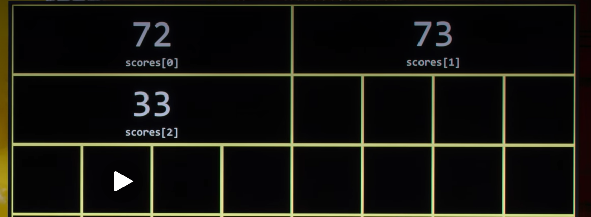
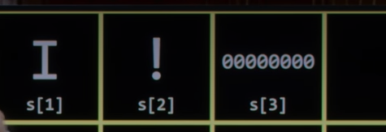
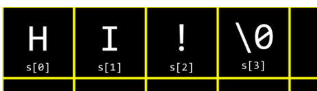
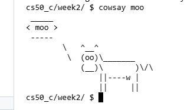
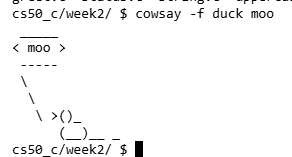

- [[arrays]]
  collapsed:: true
	- ```clike
	  #include <stdio.h>
	    
	    int main(void){
	    int scores[3];
	    scores[0] = 72;
	    scores[1] = 73;
	    scores[2] = 33;
	    
	    printf("Average %f\n", (scores[0] + scores[1] + scores[2]) / 3.0);
	  }
	  ```
	- notice here in arrays values are indeed **contiguous**, so they kind of wrap around the next row of bytes, but the computer has no notion of up or down, left or right. So to speak, it's just a piece of hardware that's got lots of bytes available that can be addressed from the first bite all the way down to the last bite. So the wrapping is just a visual artifact on this here screen...
	- 
	- We can simplify or *abstract away* the calculation of the average. Modify your code as follows:
	- ```clike
	  // Averages three numbers using an array, a constant, and a helper function
	  
	  #include <cs50.h>
	  #include <stdio.h>
	  
	  // Constant
	  const int N = 3;
	  
	  // Prototype
	  float average(int length, int array[]);
	  
	  int main(void)
	  {
	      // Get scores
	      int scores[N];
	      for (int i = 0; i < N; i++)
	      {
	          scores[i] = get_int("Score: ");
	      }
	  
	      // Print average
	      printf("Average: %f\n", average(N, scores));
	  }
	  
	  float average(int length, int array[])
	  {
	      // Calculate average
	      int sum = 0;
	      for (int i = 0; i < length; i++)
	      {
	          sum += array[i];
	      }
	      return sum / (float) length;
	  }
	  ```
	- credit: https://cs50.harvard.edu/x/notes/2/#arrays
-
- [[Magic numbers]]
  collapsed:: true
	- Typically when you have a variable that should not change its value, we should declare it as constant, and as conventional conforming also to capitalize it.
-
- [[Strings]]
  collapsed:: true
	- It turns out if we look a little further by convention, compiler will do automatically for us: is terminate that is end any string we put in double quotes with a pattern of 8 zero bits..
	- 
	- Or if more succinctly terminates with **[[nul terminator]]**:
		- 
		- more technically its still a zero(cause eight zeros will give us a zero, right.. ), but it's not like the number zero that we want to see on the screen... So, it means 8 zero bits, not the number zero...
-
- [[command-line arguments]]
	- **Command-line arguments** are those arguments that are **passed to your program at the ==command line==**. For example, all those statements you typed after `clang` are considered command line arguments. You can use these arguments in your own programs!
	- ````
	  // Prints a command-line argument
	  
	  #include <cs50.h>
	  #include <stdio.h>
	  
	  int main(int argc, string argv[])
	  {
	    if (argc == 2)
	    {
	        printf("hello, %s\n", argv[1]);
	    }
	    else
	    {
	        printf("hello, world\n");
	    }
	  }
	  }
	  ```
	  
	  Notice that this program knows both `argc`, **the number of command line arguments**, and `argv`, which is **an array of strings passed as arguments at the command line**.
	- Therefore, using the syntax of this program, executing `./greet David` would result in the program saying `hello, David`.
	- You can **print each of the command-line arguments** with the following:
	  
	  ````
	  // Prints command-line arguments
	  
	  #include <cs50.h>
	  #include <stdio.h>
	  
	  int main(int argc, string argv[])
	  {
	    for (int i = 0; i < argc; i++)
	    {
	        printf("%s\n", argv[i]);
	    }
	  }
	  }
	  ```
	  
	  Notice how this code prints out each command-line argument on its own line. The first argument (**argv[0]) is always the name of the program itself,** followed by any arguments you provide when running the program.
-
- [[Exit status]]
  collapsed:: true
	- When a program ends, a special exit code is provided to the computer.
	- When a program exits without error, a status code of ==0== is provided. Often, when an error occurs that results in the program ending, a status of ==1== is provided. (But it can also be any other number conforming to the error occurred)
	- You could write a program as follows that illustrates this by typing `code status.c` and writing code as follows:
	  
	  ```
	  *// Returns explicit value from main*
	  
	  #include *<cs50.h>*
	  #include *<stdio.h>*
	  
	  int main(int argc, string argv[])
	  {
	    **if** (argc != 2)
	    {
	        printf("Missing command-line argument**\n**");
	        **return** 1;
	    }
	    printf("hello, %s**\n**", argv[1]);
	    **return** 0;
	  }
	  ```
	  
	  Notice that if you fail to provide `./status David`, you will get an exit status of `1`. However, if you do provide `./status David`, you will get an exit status of `0`.
	- You can type ==echo $?== in the terminal **to see the exit status of the last run command**.
-
- [[cowsay]]
	- its a fun program that takes [[command-line arguments]] and quite famous, cause has been on systems for many years.
	- It allows you to type in a word after the prompt like **moo**
	- `cowsay moo` and it will print out what's callled [[ASCII Art]]
		- 
		-
	- it also takes other commands: even appearances that you want it to have: if I say `cowsay -f duck moo`
		- 
	- `cowsay -l`
		- list of available arts.. i.e.